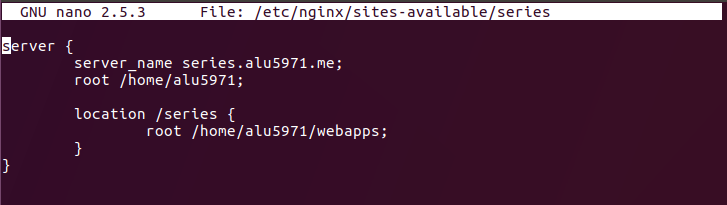
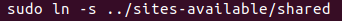
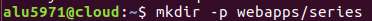
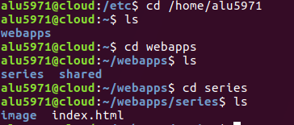
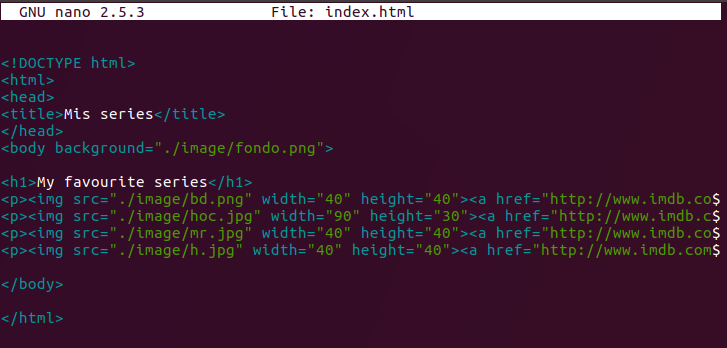
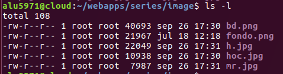
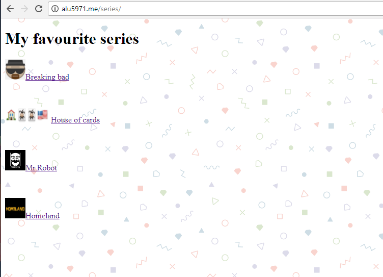

# UT1-A1: Mis series favoritas

#### Primero instalamos nginx.

    sudo apt-get install nginx
#### Para comprobar el estado de nuestro servidor web nginx:
    sudo systemctl status nginx

Ahora vamos a crear un virtual host. Para ello accedemos a **/etc/nginx/sites-available/** y creamos un fichero llamado _**series**_.

Donde pondremos el nombre del servidor (server_name) y la ruta donde esta ubicado (location).

    series.alu5971.me (_series_ seria un subdominio hay un pequeño fallo en la captura, la sintaxis correcta seria alu5971.me)

#### Creación de enlaces simbólicos.

Nginx tiene un sistema para poder experimentar con nuestro servidor sin poner en riesgo nuestro trabajo, separa en dos carpetas los archivos de configuración sites-available y sites-enabled (available serían los que no se pueden ver desde el exterior y enabled los que están permitidos), por ello necesitamos crear unos enlaces simbólicos de los archivos para no tener que estar copiando entre carpetas.

    La captura tiene otro nombre _shared_ porque es de una práctica reciente pero solo tendríamos que cambiar el nombre por _series_.

#### Siguiente paso: Creación de directorio para nuestro host virtual.

En este caso seria en nuestro directorio local tal y como hemos puesto en el archivo de configuración que hemos editado previamente

#### Paso Final: Creación de página web.

Por último solo tendríamos que crear nuestra página web.

Añadiendo fotos,links...

    La crearíamos como un index.html dentro de nuestra carpeta en **/home/alu5971/webapps/series/index.html** y las imágenes en una carpeta con el nombre img por ejemplo.

### Resultado Final.

alu5971.me/series

