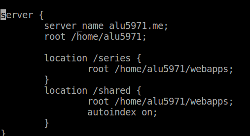
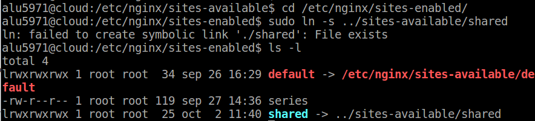
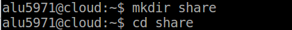
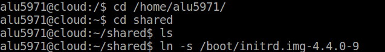
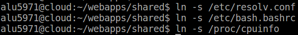
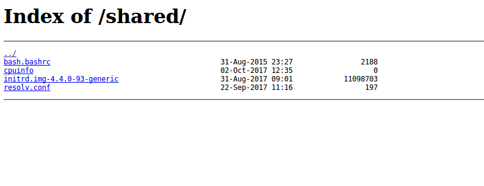

# UT1-A2: Listado de directorios.

### Primero creamos el archivo shared en /etc/nginx/sites-available.

Ahí tendremos que añadir una nueva localización de nuestro nuevo directorio.

    /home/alu5971/webapps/shared

    Tenemos que añadir un autoindex on dentro del location /shared para que se puedan ver los archivos ya que por defecto esta opción está deshabilitada.

### Segundo creamos un enlace simbólico para nuestro archivo si no lo hemos creado.

Utilizamos el comando ln -s junto con la ruta del archivo que queremos enlazar en este caso sería:

    sudo ln -s ../sites-available/shared

### Tercero creamos la carpeta en el directorio que hemos especificado en el primer paso.

     /home/alu5971/webapps/shared

### Por último creamos los enlaces simbólicos para cada fichero que queramos mostrar.

 * /boot/initrd.img-4.4.0-9
 * /etc/resolv.conf
 * /etc/bash.bashrc
 * /proc/cpuinfo

 

 

 ## Resultado Final

 http://alu5971.me/shared/

 
