## UT1-A3:Trabajo con virtual hosts

### Sitio web 1

http://imw.alu5971.me y http://imw.alu5971.me/mec/

Primero creamos un virtual hosts en sites-available donde indicamos el subdominio imw y dentro del subdominio la carpeta mec. Indicamos la ruta donde se aloja el subdominio.

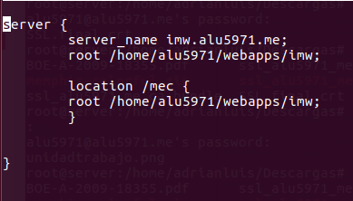

Enlazamos el archivo que está en sites-available con el de sites-enabled con un enlace simbolico.

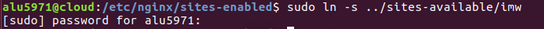

Ahora creamos los html que se van a ejecutar en cada pagina (index.html).

##### *Imagen:*

Simplemente hacemos un img src y escribimos la ruta donde tengamos el archivo.

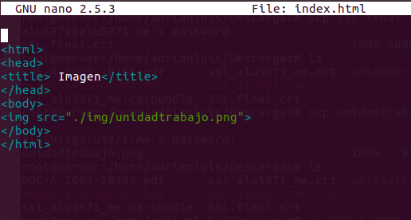

Para descargar una imagen desde nuestra máquina de clase (imw) hacia la nube (cloud) utilizamos el comando scp.

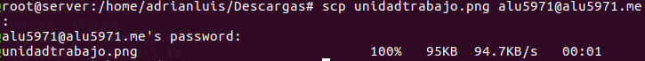

Y movemos hacia la carpeta que hemos creado previamente (la que nosotros queramos) en mi caso en webapps/imw/img.

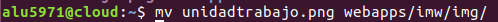

##### *PDF:*

Repetimos el proceso creamos un index.html donde pondremos la ruta donde se encuentra el pdf que queremos mostrar(boe.pdf) con el a href="ruta".

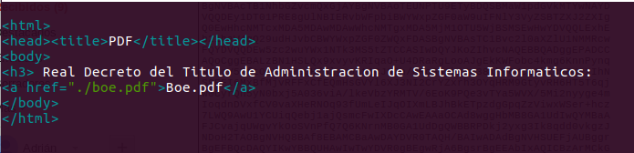

Utilizamos scp para subir nuestro pdf al servidor.

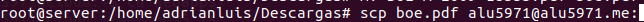

Y lo movemos hacia el directorio correspondiente.

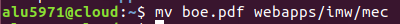

Una vez terminado reiniciamos el servicio nginx.

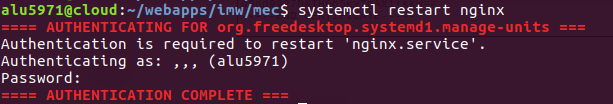

### Resultado final:

##### *Imagen :*

http://imw.alu5971.me

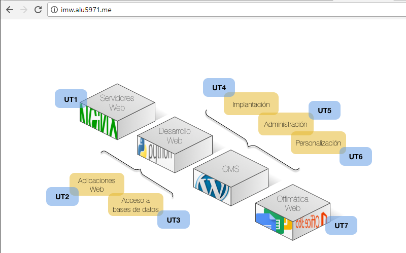

##### *PDF :*

http://imw.alu5971.me/mec/

### Sitio web 2

http://varlib.alu5971.me:9000

Creamos un virtual host en sites-available llamado varlib.Donde indicamos el subdominio, el puerto de escucha, la carpeta donde se encuentra el contenido a mostrar y autoindex para que se pueda ver.

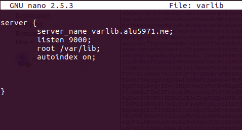

Creamos el enlace simbolico del sites-available en sites-enabled.

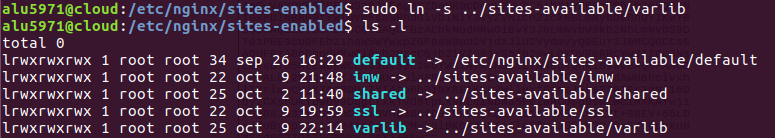

Reiniciamos el servicio nginx.

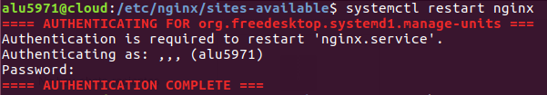

#### Resultado final

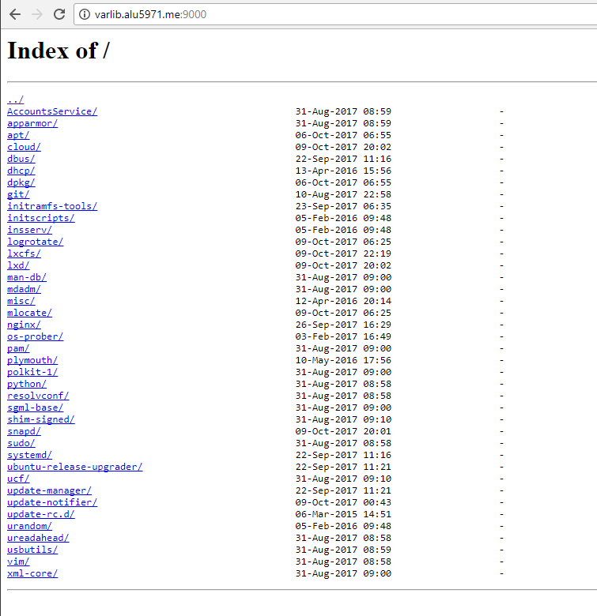

### Sitio web 3

https://ssl.alu5971.me/students/

Primero creamos el virtual host en sites-available llamado ssl. Donde indicamos el puerto de escucha,el subdominio, la ruta donde se encuentra las claves(certificados) para el ssl y el directorio students junto con el archivo de usuario y contraseña(.htpasswd).

Creamos la carpeta en el directorio webapps.

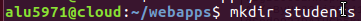

Creamos el index.html dentro de students donde pondremos los nombres de los alumnos.

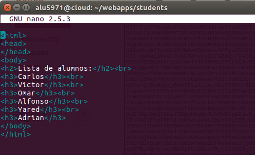

Ahora creamos la clave encriptada "aula108" con el comando perl.

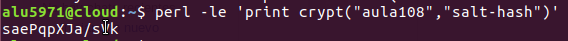

La copiamos y la añadimos al archivo .htpasswd junto con el nombre de usuario "usuario1" (en mi caso puse admin pero fue un error que ya está solucionado) utilizando el echo.

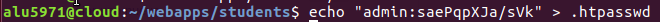

Para prohibir el acceso al fichero .htpasswd utilizaremos el location junto con la ruta del archivo que queremos denegar y el deny all.

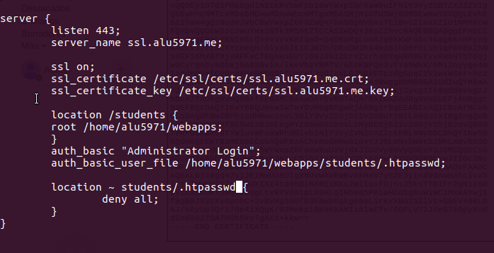

Reiniciamos el servicio nginx.

### Resultado final

##### *Login*

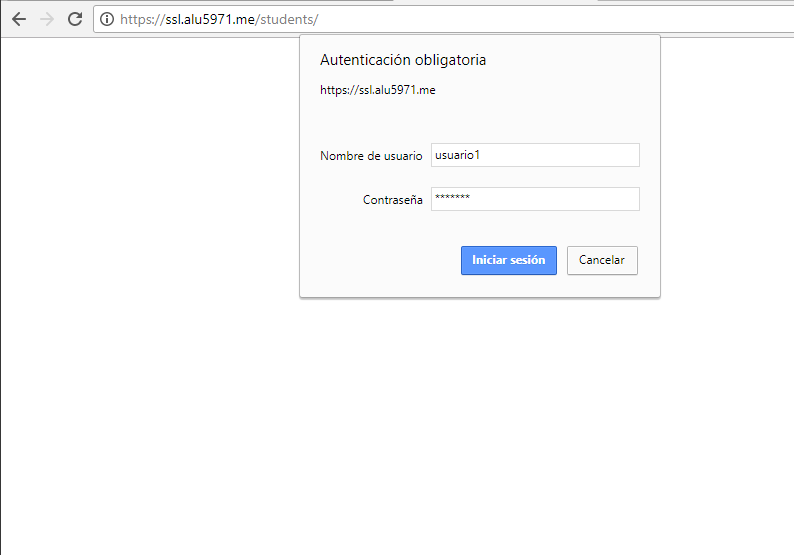

##### *html*

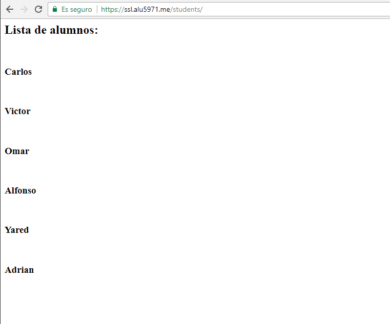

### Sitio web 4

http://redirect.alu5971.me

Primero creamos los virtual host target y redirect en sites-available.

##### *Target*

Añadimos el nombre del subdominio target.alu5971.me, la carpeta donde se va alojar y la dirección de los logs(hay que crear la carpeta redirect en /var/log/nginx)

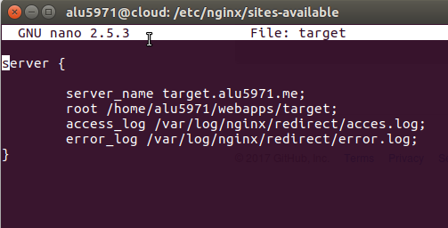

##### *Redirect*

Añadimos un virtual host que su subdominio será redirect.alu5971.me, escucha en el puerto 80, añadimos la carpeta donde se encuentra y le decimos que retorna hacia target.alu5971.me.

Añadimos otro virtual host que su subdominio será www.redirect.alu5971.me que escucha en el puerto 80 y retorna hacia target.alu5971.me.

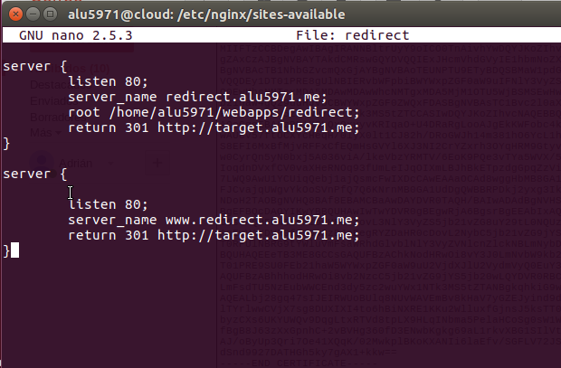

Creamos las carpetas necesarias con mkdir.

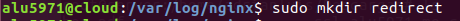

(una vez accedamos a las páginas se nos crearán los archivos .log)

Ahora para añadir la página web al directorio webapps/target necesitamos usar el comando scp

     scp nombredelarchivo alu5971@alu5971.me:

Quedará en nuestro home.
Después instalamos el unzip y lo descomprimimos.

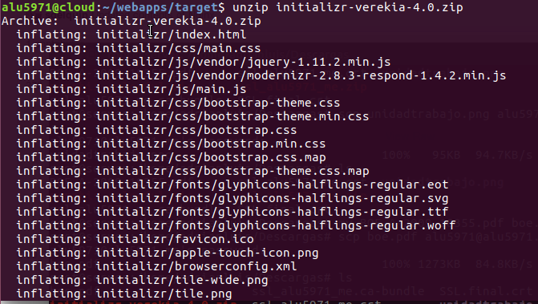

Y lo movemos al directorio deseado en este caso webapps/target.

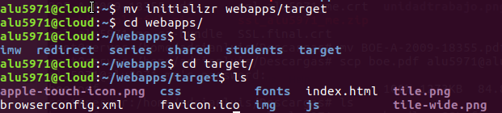

Reiniciamos el servicio nginx.

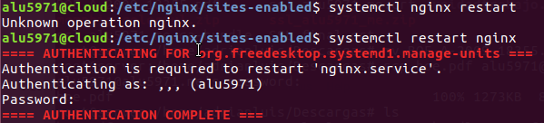

### Resultado final

http://www.redirect.alu5971.me/hola/

http://www.redirect.alu5971.me/probando/

http://redirect.alu5971.me/test/

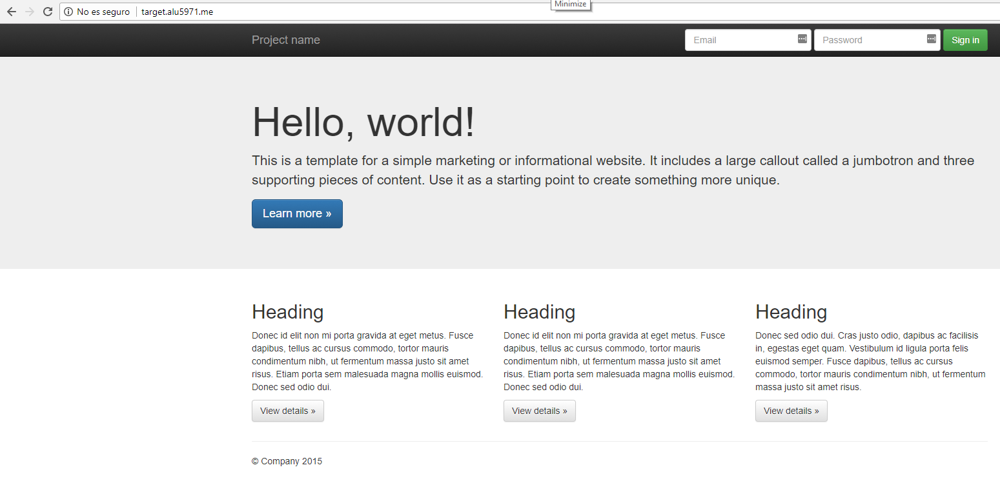
