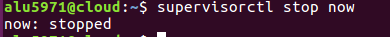

# UT1-A4: Sirviendo aplicaciones Php y Python

## Sitio web 1

* http://php.alu5971.me

Primero creamos un **virtual host** llamado *php*.

* Añadimos el nombre del servidor *php.alu5971.me*
* Un **index**, en este caso *index.php* porque la página es en **php**.
* **Root** : La dirección donde se ubica el *index.php* que vamos a mostrar.
* Por ultimo añadimos un location para decirle a *nginx* donde tiene que buscar el programa que va a traducir el código **php** *(php-fpm)*.

Después creamos el enlace simbólico con **ln -s**.

Subimos el archivo **demo_php.zip** a la máquina **cloud**.

Una vez en la máquina cloud descomprimimos el archivo con *unzip*.

Y movemos la carpeta que hemos descomprimido hacia el directorio *webapps/php*.

Por último recargamos el **servicio nginx**.

### Resultado :

## Sitio web 2

* http://now.alu5971.me

Una vez instalado *python* :

    sudo apt-get install python3.6

Instalamos las librerías para el funcionamiento de *python* :

    sudo apt-get install python3.6-dev

Por último instalamos el compilador de C:

    sudo apt install gcc

Creamos la carpeta **now** en nuesto home.

Creamos el **entorno virtual** en .virtualenvs(carpeta oculta) llamado now.

Para entrar en nuestro **entorno virtual** tenemos que hacer lo siguiente :

### uWSGI

Instalamos *flask* y *uwsgi* dentro de nuestro **entorno virtual** (now), serán los encargados de traducir el código *python* para que nginx pueda mostrarlo correctamente :

Ahora nos dirigimos a nuestro al directorio **/home/alu5971/now** y creamos un fichero llamado *main.py* donde estará el codigo que aparecerá en la página.

Ahora lanzamos el proceso que escuchar-a peticiones :

    uwsgi --socket 0.0.0.0:8080 --protocol=http -w main:app

### Configuración del servidor web

Creamos el fichero de configuración para
**uWSGI** (/home/alu5971/now):

    nano uwsgi.ini

También creamos el fichero *run.sh* en el mismo directorio.

    nano run.sh

Le damos permisos para poder ejecutarlo.

### Nginx

Vamos a crear un **virtual host** para *python*.

    sudo nano /etc/nginx/sites-available/now

* Nombramos al virtual host *now.alu5971.me*

* Añadimos un location para definir el área de intercambio */tmp/now.sock* y otro para definir una ruta donde pondremos los ficheros estáticos.

Y enlazamos el **virtual host** para habilitarlo en **sites-enabled**

Recargamos el servicio *nginx*:

Ahora activamos el *run.sh*:

    ./run.sh

#### Prueba:

### Supervisor

Utilizamos supervisor para poder controlar nuestro proceso **(Reiniciarlo, apagarlo, pararlo..)**.

#### Configuración

Añadimos un archivo de configuración para que supervisor pueda gestionar *now*.

* Especificamos el **programa** que vamos a administrar.

* Elegimos el **usuario** encargado de administrarlo.

* Seleccionamos el archivo que tiene el **script** que vamos a ejecutar.

* Activamos el **autostart** para que se active automáticamente.

* Activamos el **autorestart** para que se reinice si hay algún problema.

* Activamos el **killasgroup** para que mate a los grupos hijos.

* Añadimos la ruta donde se van alojar los archivo de **log** (*now.err.log - now.out.log*).

#### Comandos de comprobación :

#### Modificaciones :

Editamos el fichero */home/alu5971/now/main.py* para que muestre la hora de **Canarias**.

Instalamos *pytz*(dentro del entorno virtual **now**):

    pip install pytz

Y reiniciamos el proceso :

    supervisorctl restart now

