# UT4-A1: Implantación de Wordpress

## 1. Instalación de wordpress en el dominio wordpress.alu5971.me

Iniciamos sesión como root en nuestro servidor mysql y creamos la base de datos , el usuario y asignamos privilegios utilizando los siguientes comandos:

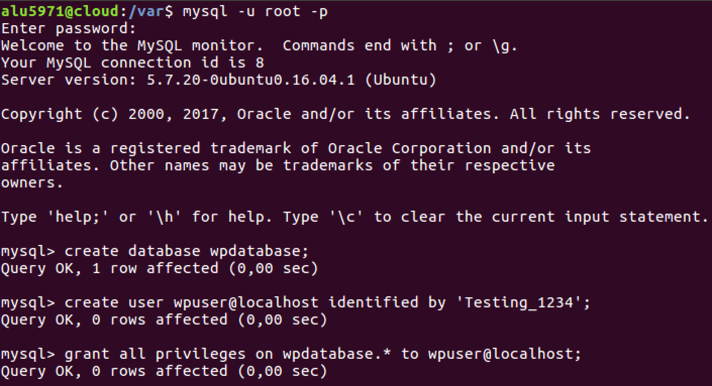

## 1.1 Descarga de código

Descargamos el código fuente de Wordpress desde su página web oficial:

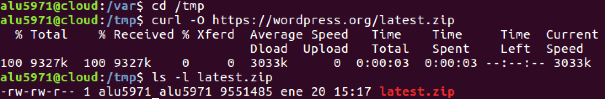

Despues descomprimimos el código y lo copiamos en /usr/share:

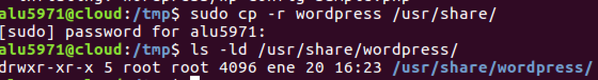

Ahora tenemos que establecer los permisos necesarios para que el usuario web ww-data pueda usar estos ficheros:

## 1.2 Editar ficheros de configuración

Activamos el fichero wp-config-sample.php cambiandole el nombre para que wordpress utilice la configuración establecida.

Después lo modificamos para especificar el nombre de la base de datos, el usuario y la contraseña para que wordpress pueda usarlo:

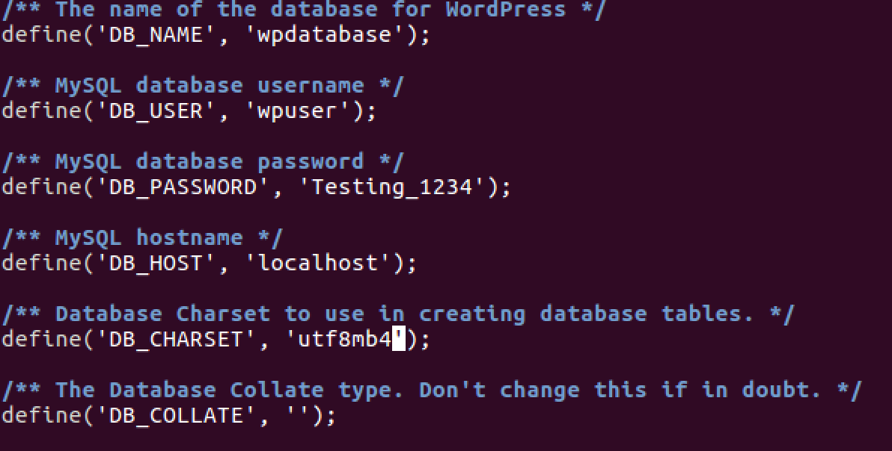

## 1.3 Acceso mediante Nginx

Creamos un nuevo sitio para nuestro servidor nginx en la siguiente ruta:

     /etc/nginx/sites-available/wordpress
Modificamos el fichero de la siguiente manera:

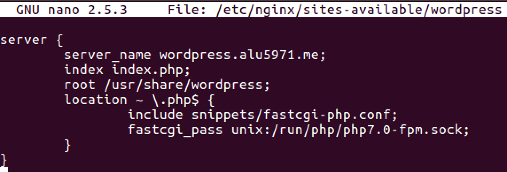

Enlazamos la configuración para que el virtual host esté disponible:

    /etc/nginx/sites-enabled/Wordpress
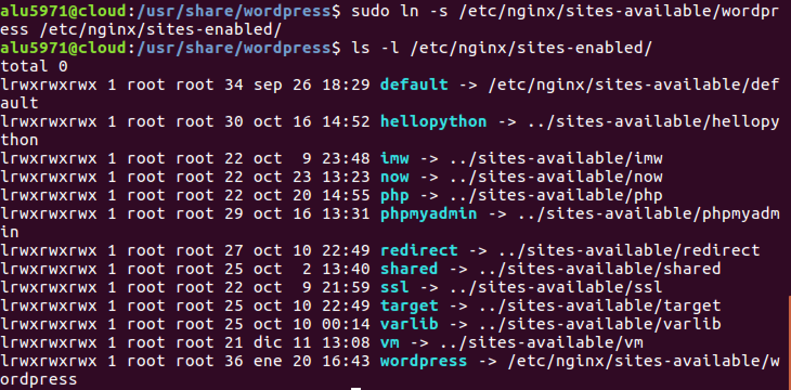

Recargamos el servidor nginx con systemctl reload nginx.

## 1.4 Configuración del sitio vía web

Accedemos a **wordpress.alu5971.me** para empezar a configurar nuestro wordpress.

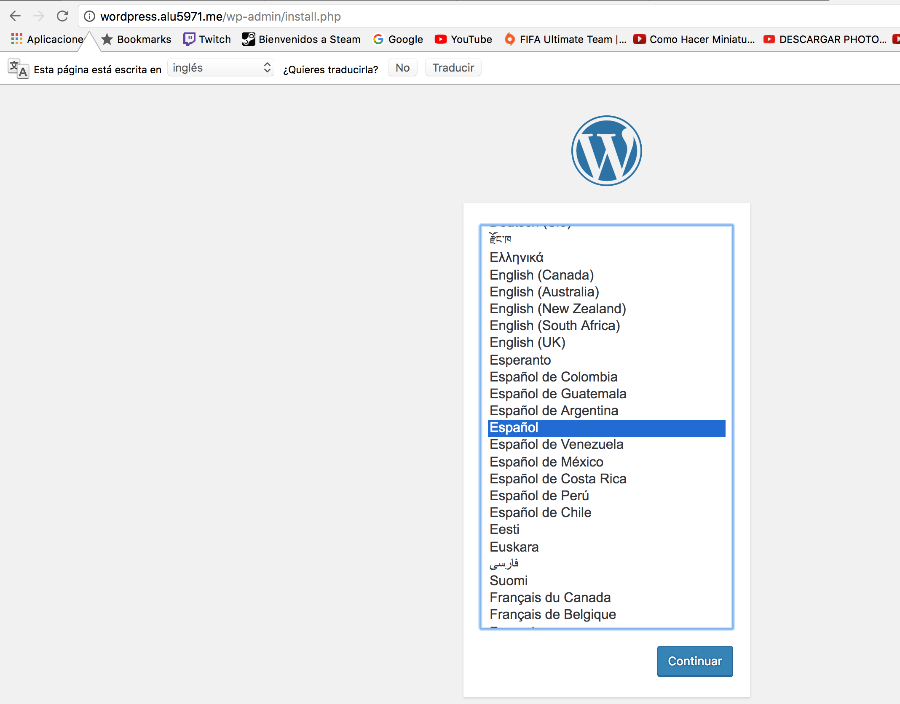

Eligimos el idioma español y añadimos una contraseña.

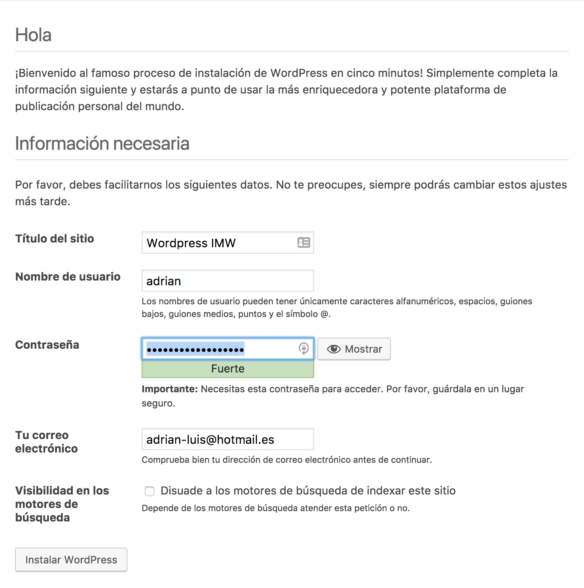

Instalamos wordpress.

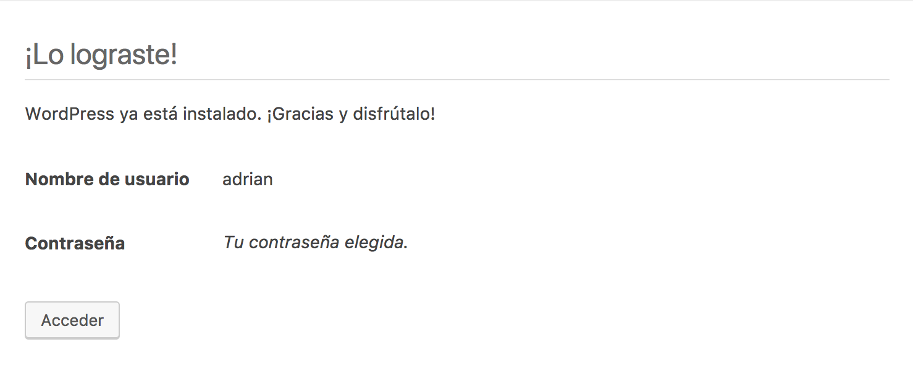

Actualizamos la página y nos pedirá que introduzcamos nombre de usuario y contraseña.

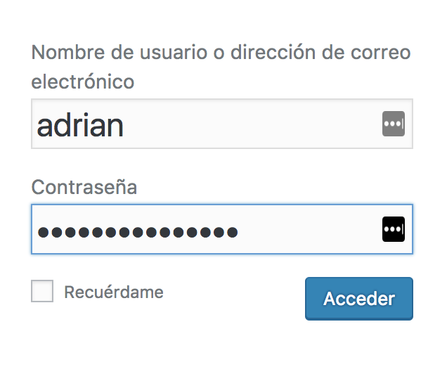

Ahora podreamos acceder a la interfaz administrativa de wordpress:

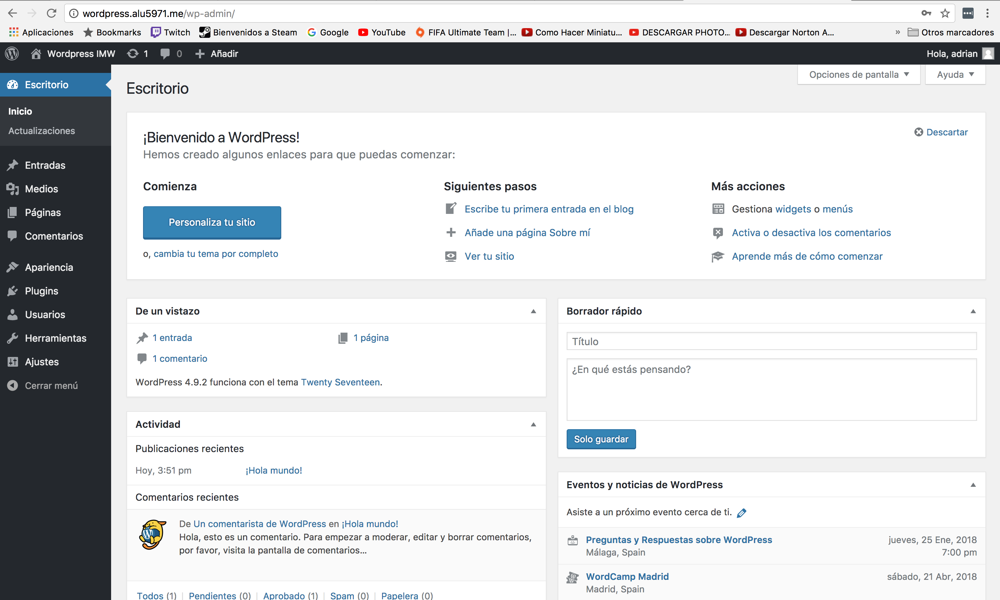

## 2. Instalar y activar un tema gratuito.

Nos dirigimos a Apariencia - Temas y elegimos un tema para instalarlo.

Una vez instalado lo seleccionamos como activo para utilizarlo en nuestra web.

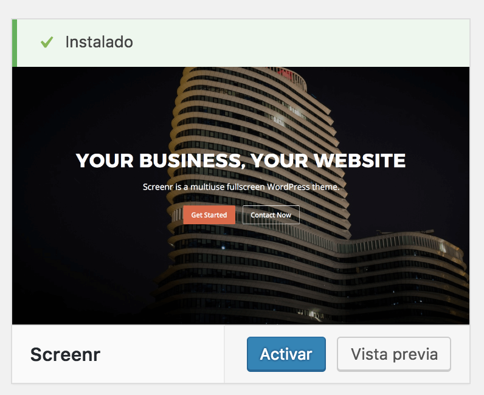

Podemos comprobar su correcto funcionamiento accediendo a wordpress.alu5971.me

## 3. Ajustar los permalinks a Día y nombre

Nos dirigimos a Ajustes - Enlaces permanentes y en Ajustes comunes seleccionamos Día y nombre.

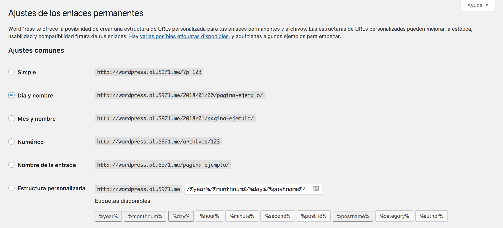

Ahora accedemos por terminal a nuestra máquina e indicamos a Nginx que procese estas URLs modificando el fichero /etc/nginx/sites-available/wordpress

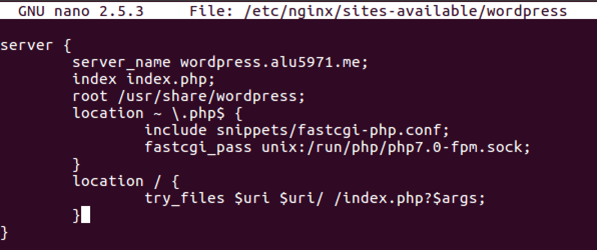

Recargamos la configuración de nginx con el siguiente comando:

    systemctl reload nginx
## 4. Escribir un post con las estadísticas de uso de Wordpress

Añadimos una nueva entrada accediendo a Entradas - Añadir nueva. Y creamos un post a nuestro gusto sobre las estadísticas de wordpress.

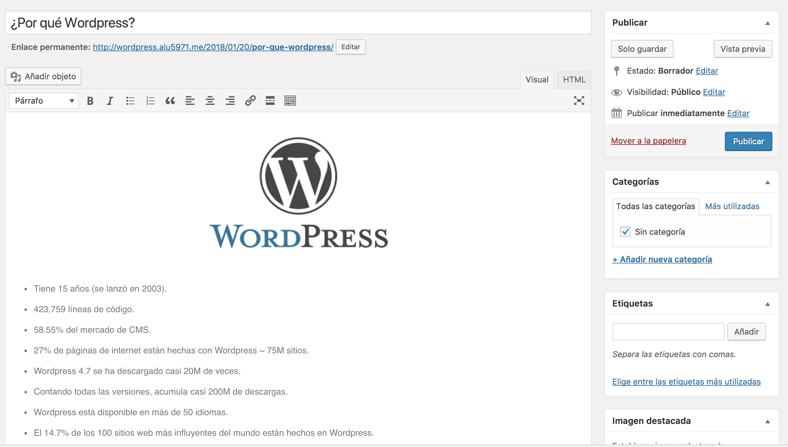

Aquí podemos ver la entrada cuando se publica en nuestro blog.

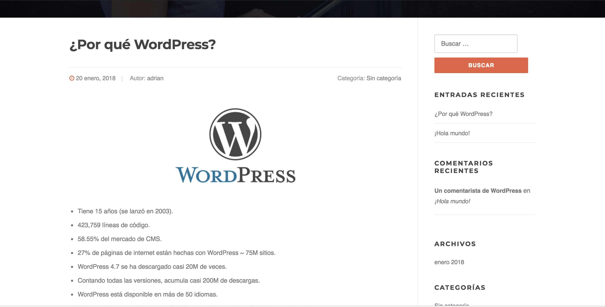

    
